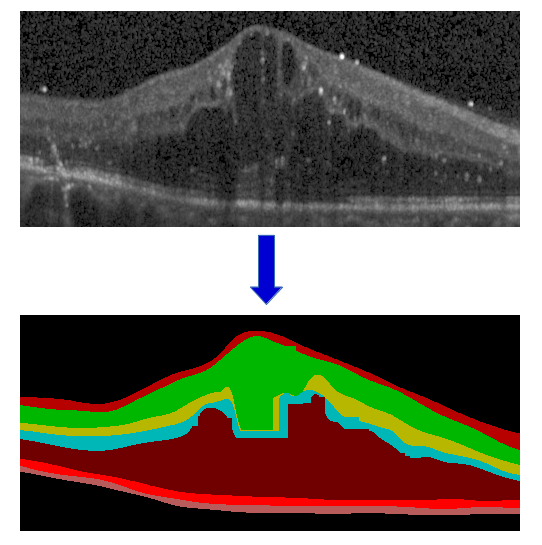
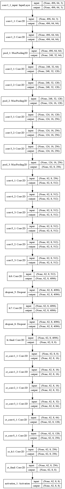

## Feature Aggregation for segmentation using dilated convolutions

- Segmentation of Retinal Layers in Optical Coherence Tomography Images (paper implementation).
- Papers :
   - Main paper: [Retinal Layer Segmentation using Dilated Convolutions](https://github.com/Rakeshpavan333/oct_dil/blob/master/cvip2018.pdf)
   - Dilated Convolutions: [Multi-Scale Context Aggregation by Dilated Convolutions](https://arxiv.org/abs/1511.07122)

#### Example Input/Output

#### Model Architecture 

